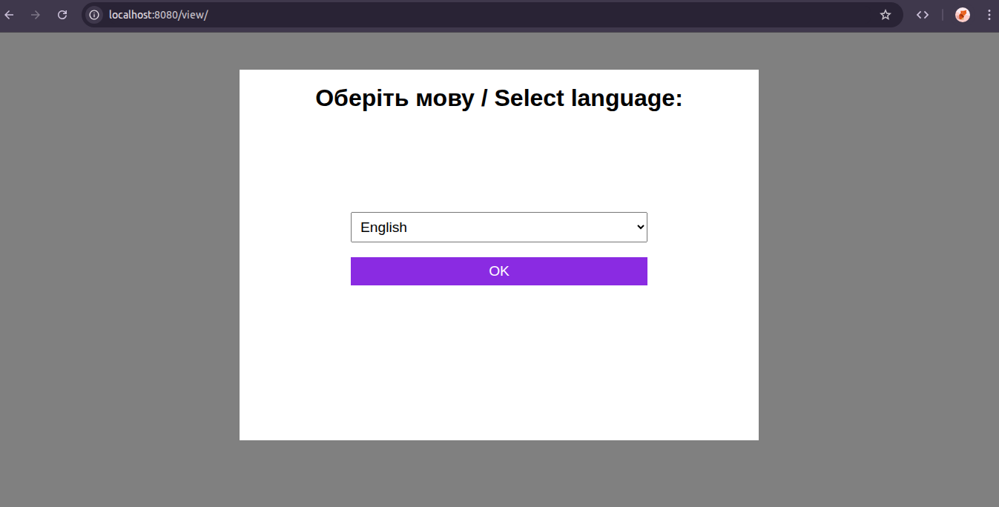
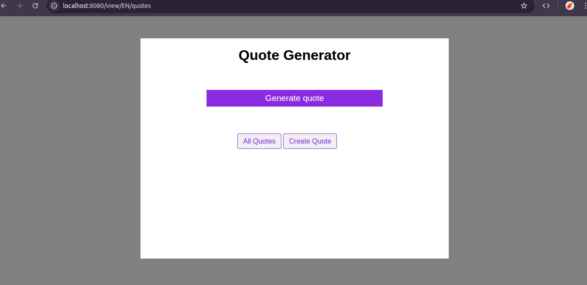
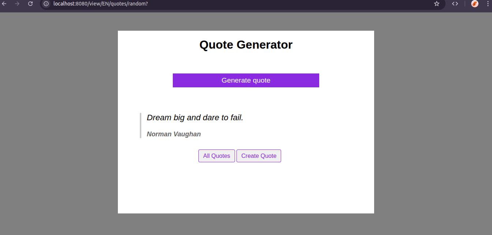
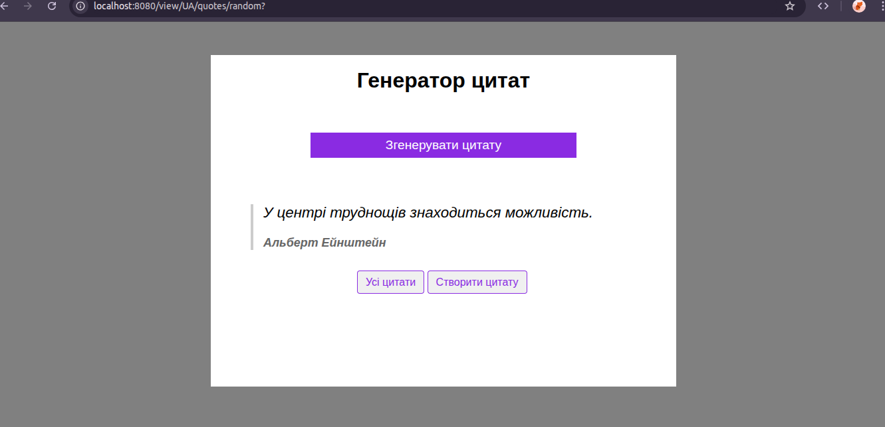
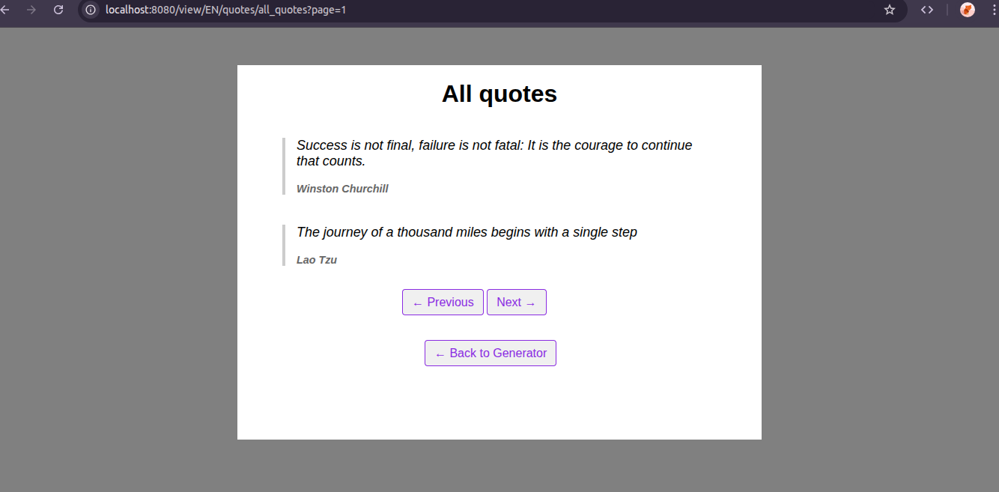
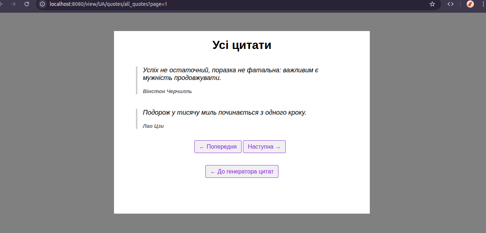
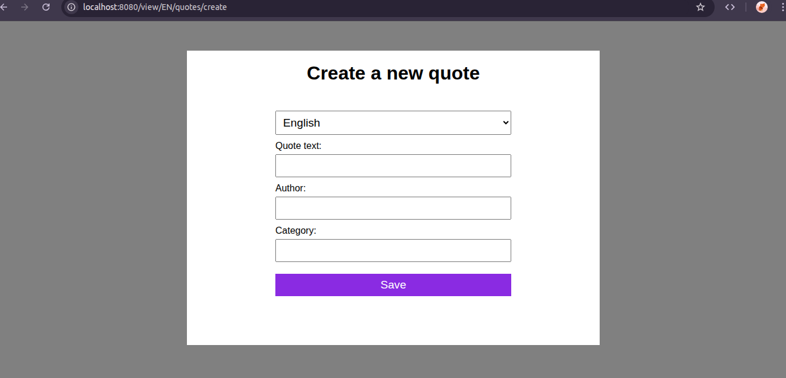
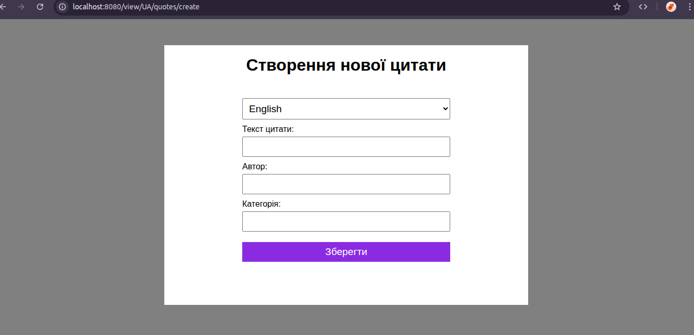

# 🌐 Multilingual Quote Generator Web App

A simple yet functional full-stack Java web application that allows users to view, create, and browse random motivational quotes in different languages (English 🇬🇧 & Ukrainian 🇺🇦).

## 🚀 Features

- 🔁 Get a random quote by language
- 📜 View all quotes (with pagination)
- ➕ Add new quotes via form
- 🌍 Multilingual routing using enums (`/view/EN/...`, `/view/UA/...`)
- 🔧 REST API support for backend operations
- 📄 Thymeleaf frontend templates
- 🧪 Unit & Integration tests included
- 📝 Logging via SLF4J + Logback

---

## 📷 Screenshots

### 🌐 Select Language Page (`/view/`)
This page allows users to choose between supported languages (English and Ukrainian) before navigating through quotes.  
Implemented using Spring MVC and Thymeleaf.

- 🔘 Two language buttons: `EN` and `UA`
- ✅ Language choice is passed to the controller as an enum (`Languages.EN`, `Languages.UA`)
- 🎯 After selection, user is redirected to the corresponding localized quote page



### 🏠 Main Quote Page (`/view/{language}/quotes`)


### 🏠 Quote Page With Random Quote (`/view/{language}/quotes/random`)



### 📚 All Quotes Paginated (`/view/{language}/quotes/all_quotes`)



### ✍️ Create New Quote (`/view/{language}/quotes/all_quotes`)



---

## 📦 Tech Stack

### 👩‍💻 Backend:
- Java 17+
- Spring Boot 3.5.0
- Spring MVC + Spring Web
- Spring Data JPA
- Hibernate
- MySQL (or H2 for dev/testing)
- Lombok
- SLF4J + Logback

### 🌐 Frontend:
- HTML5 + CSS3
- Thymeleaf (template engine)

### 🧪 Testing:
- JUnit 5
- Mockito
- Unit tests for both View and REST controllers

## 🔗 REST API Endpoints

| Method | Endpoint                          | Description              |
|--------|-----------------------------------|--------------------------|
| GET    | `/api/{language}/quotes/random`   | Returns one random quote |
| GET    | `/api/{language}/quotes/all_quotes` | Returns all quotes for a language |

---

## 📁 Project Structure

```
src/
├── main/
│   ├── java/
│   │   └── com/quotegenerator/
│   │       ├── controller/
│   │       │   ├── api/
│   │       │   │   └── QuoteController.java         
│   │       │   └── view/      
│   │       │       └── ViewController.java
│   │       ├── model/
│   │       │   ├── Languages.java                    
│   │       │   └── Quote.java                   
│   │       ├── repository/
│   │       │   └── QuoteRepository.java             
│   │       ├── service/
│   │       │   └── QuoteService.java   
│   │       └── QuoteGeneratorApplication         
│   └── resources/
│       ├── static/                 
│       │   └── css/
│       │       └── style.css 
│       ├── templates/ 
│       │   ├── show-quotes.html                          
│       │   ├── index.html  
│       │   ├── select-language.html                   
│       │   └── show-quotes.html   
│       ├── application.properties   
│       └── logback.xml           
├── test/
│   └── java/
│       └── com/quotegenerator/
│           ├── controller/
│           │   ├── api/
│           │   │   └── QuoteControllerTest.java 
│           │   └── view/      
│           │       └── ViewControllerTest.java            
│           └── QuoteGeneratorApplicationTests.java          
```


---

## 🏁 Getting Started

1. Clone the repo:
   ```bash
   git clone https://github.com/NataliaJavaDev/quote-generator.git
   cd quote-generator

2. Update database settings in application.properties.
3. Run the app:

   ```bash
   mvn spring-boot:run
   
4. Open in browser:

   ```bash
   http://localhost:8080/view/